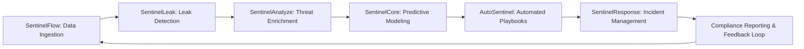

# SentinelIQ

## Enterprise Threat Intelligence & Response Platform

SentinelIQ delivers a unified, end-to-end solution for threat detection, analysis, and automated response—empowering security teams to proactively identify, investigate, and remediate risks at scale.

---

### 🚀 Key Projects

| Project           | Description                                                                                                                       | Status         | Repository                                              |
|-------------------|-----------------------------------------------------------------------------------------------------------------------------------|----------------|---------------------------------------------------------|
| **SentinelCore**      | Enterprise-grade machine learning library for data preprocessing, modeling, and predictive analytics.                            | In Development | https://github.com/SentinelIQ/SentinelCore              |
| **SentinelResponse**  | Comprehensive incident response platform integrated with MISP for real-time collaboration, case management, and reporting.      | In Development | https://github.com/SentinelIQ/SentinelResponse          |
| **SentinelAnalyze**   | Scalable observables analysis and enrichment platform with REST API and customizable dashboards.                                 | In Development | https://github.com/SentinelIQ/SentinelAnalyze           |
| **AutoSentinel**      | Automation and orchestration framework for end-to-end security workflows and playbook execution.                                | Beta           | https://github.com/SentinelIQ/AutoSentinel              |
| **SentinelLeak**      | Advanced data leak detection platform for continuous monitoring, classification, and automated remediation of exposed sensitive data. | Planning      | https://github.com/SentinelIQ/SentinelLeak              |

---

### 🗺️ Enterprise Roadmap (Q2–Q4 2025)

| Quarter | SentinelCore                     | SentinelAnalyze                 | SentinelResponse                 | AutoSentinel                  | SentinelLeak                          |
|---------|----------------------------------|---------------------------------|----------------------------------|-------------------------------|---------------------------------------|
| Q2 2025 | MVP Release & Initial Documentation | API Core Launch                 | MVP Release & MISP Integration   | Beta Enhancements             | Repository & MVP Data Collection      |
| Q3 2025 | v1.0 Stable Release & Performance Tuning | UI Dashboard & Bulk Processing | Beta Release & Advanced Workflows | GA Release & SIEM Integration | Classification Pipeline & Alerts UI   |
| Q4 2025 | Platform Integration with SentinelFlow | Scalability Optimizations       | General Availability & Reporting | Expanded Connector Ecosystem  | Automated Remediation Workflows       |

---

### 🔗 Integrated Workflow Architecture

The SentinelIQ platform components integrate seamlessly to provide a continuous threat intelligence lifecycle:

1. **Data Collection & Leak Detection**
   - SentinelFlow and SentinelLeak harvest and normalize internal logs, external feeds, paste sites, and dark web sources.
2. **Enrichment & Analysis**
   - SentinelAnalyze enriches and correlates indicators of compromise (IOCs) through automated enrichment pipelines.
3. **Predictive Modeling**
   - SentinelCore applies machine learning to detect anomalies, forecast threats, and prioritize risk.
4. **Orchestration & Automation**
   - AutoSentinel executes playbooks for credential rotation, URL blocking, ticketing, and remediation.
5. **Incident Management & Response**
   - SentinelResponse centralizes case management, threat sharing (via MISP), and audit-ready compliance reporting.

---

### 🛠️ Enterprise Workflow

This workflow ensures a closed-loop, proactive security posture by continuously feeding insights back into the system for ongoing optimization.

---

### 📚 Technology Stack

- **Languages:** Python, TypeScript  
- **ML Frameworks:** TensorFlow, PyTorch  
- **Data Infrastructure:** Apache Kafka, Elasticsearch, PostgreSQL  
- **Orchestration:** Apache Airflow, Kubernetes, Docker  
- **APIs:** FastAPI, RESTful services  
- **Frontend:** React, Material UI  

---

### 📖 Documentation & Support

- **Docs Portal:** https://docs.SentinelIQ.com.br  
- **User Guides:** https://docs.SentinelIQ.com.br/user-guides  
- **Developer Setup:** https://docs.SentinelIQ.com.br/dev-setup  
- **Issue Tracker:** https://github.com/SentinelIQ/SentinelIQ/issues  
- **Contribution Form:** https://forms.SentinelIQ.com.br/submit  

---

### 📞 Contact & Community

- **Support:** support@sentineliq.com.br  
- **Community IRC:** #sentineliq on Libera.Chat  
- **GPG Key:** https://sentineliq.com.br/gpg-key  

---

### 📜 License

Released under a BSD‑style license. See LICENSE for full details.

© 2025 SentinelIQ — Securing Tomorrow, Today.

